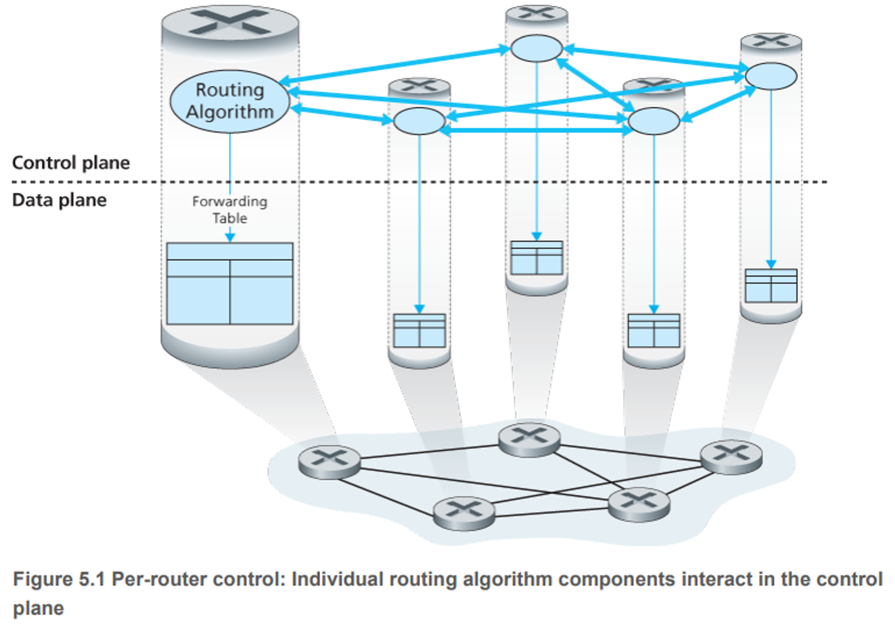
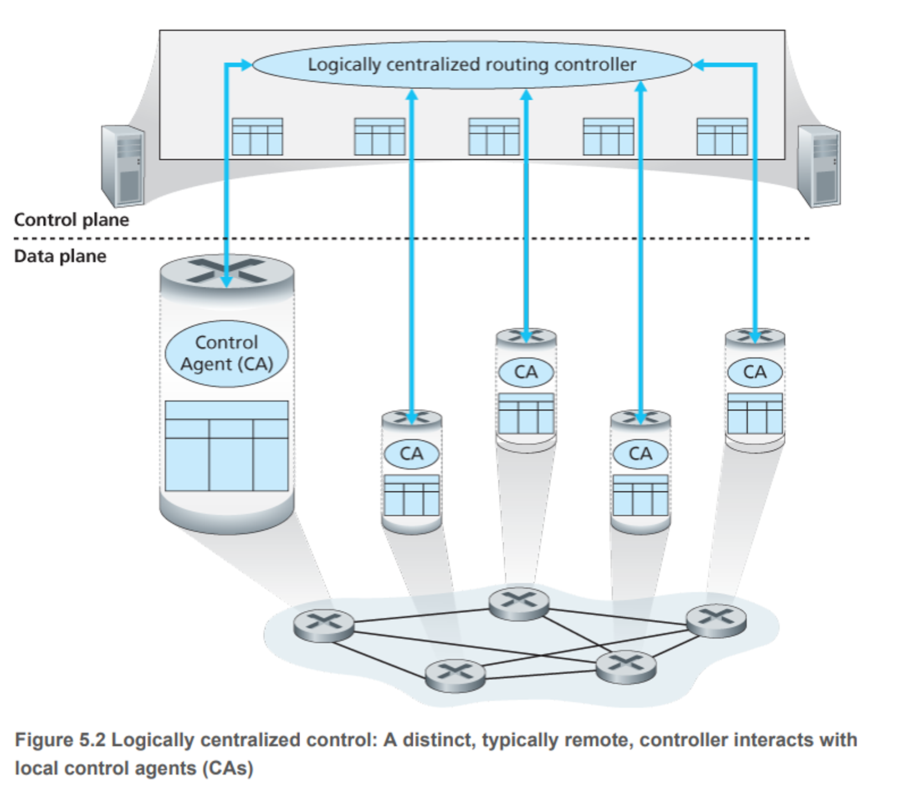

# chapter5.1 개요

- 이번 챕터에서는 포워딩 테이블이나 플로우 테이블이 어떻게 만들어지고 유지 및 설치되는지 알아본다.
- 제어에는 두 가지 방법이 있다.

### 라우터별 제어

- 라우팅 알고리즘들이 모든 라우터 각각에서 동작하는 경우
- 포워딩과 라우팅 기능이 모두 개별 라우터에 포함되어 있다.
- 각 라우터는 다른 라우터의 라우팅 구성요소와 통신하여 자신의 포워딩 테이블의 값을 계산하는 라우팅 구성요소를 가짐
- OSPF와 BGP 프로토콜이 이에 해당함

### 논리적 중앙 집중형 제어

- 논리적 중앙 집중형 컨트롤러가 포워딩 테이블을 작성하고 이를 모든 개별 라우터가 사용할 수 있도록 배포한 경우
- 일반화된 ‘매치 플러스 액션’ 추상화를 통해 라우터는 기존에는 별도의 장치로 구현되었던 다양한 기능뿐만 아니라 전통적인 IP 포워딩을 수행

---

- 컨트롤러는 잘 정의된 프로토콜을 통해 각 라우터의 제어 에이전트(Control Agent)와 상호작용하여 라우터의 플로우 테이블을 구성 및 관리
- CA는 단순히 컨트롤러의 명령을 수행하는 최소 기능을 가지며 포워딩 테이블을 계산하는 데도 적극적으로 참여하지 않는다.
- 이것이 중앙 집중형과 가장 큰 차이점

---

- ‘논리적 중앙 집중형’ 제어란 실제로는 고장 또는 참여 호스트 수의 증가에 따른 성능 저하 문제에 대응하기 위해 여러 개의 서버에 라우팅 서비스가 구현된다 하더라도 마치 하나의 중앙 서비스 지점에 있는 것처럼 서비스에 접근
- SDN은 논리적 중앙 집중형 컨트롤러라는, 실제 설치 제품에 사용이 증가하고 있는 개념을 채택