# 5.2 라우팅 알고리즘

- 라우팅 알고리즘의 목표는 송신자부터 수신자까지 라우터의 네트워크를 통과하는 좋은 경로를 결정하는 것
- ‘좋은’ 경로란 최소 비용 경로
- 네트워크 제어 평면이 라우터별 제어 방식을 채택하든 논리적 중앙 집중형 방식을 채택하든 상관없이 잘 정의된 일련의 라우터가 항상 존재해야함.
- 그렇기에 이러한 라우팅 알고리즘은 기본이다.
- 보통 이러한 라우팅 문제를 그래프로 표현해서 보이곤 한다.
- 그래프는 G(N,E)로 나타내는데 N과 E는 각각 노드와 에지의 집합이고, 하나의 에지는 집합 N에 속하는 한 쌍의 노드로 표시
- 일반적인 알고리즘 문제에서 그래프 문제를 떠올리면 편할 것이다.

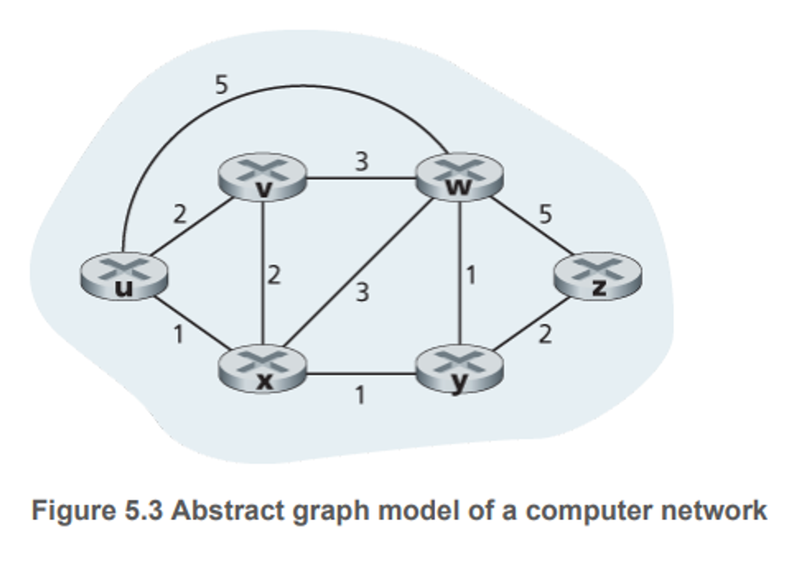

- 에지는 비용을 나타낸다.
- 이 비용은 물리적 거리, 속도, 금전적 비용 등이 포함된 숫자이다.
- 우리는 이러한 그래프 집단에서 최소 비용 경로는 하나일 수도 있고 여러 개 일수도 있다.
- 이러한 라우팅 알고리즘은 최적의 경로 즉, 최소 비용 경로를 찾는 것이다.
- 그럼 라우팅 알고리즘에는 여러 종류가 있을 것이고 이러한 분류에 대표적인 방법은 중앙 집중형인지 분산형인지다.

### 중앙 집중형 알고리즘

- 네트워크 전체에 대한 완전한 정보를 가지고 출발지와 목적지 사이의 최소 비용 경로를 계산한다.
- 즉, 이 알고리즘은 모든 노드 사이의 연결 상태와 링크 비용을 입력값으로 한다.
- 그럴려면 이러한 정보들은 사전에 어떠한 방법으로 얻어야할 것이다.
- 전체 상태 정보를 갖는 알고리즘을 링크 상태(LS) 알고리즘이라고 하는데, 이는 이 알고리즘이 네트워크 내 각 링크의 비용을 알고 있어야 하기 깨문이다.

### 분산 라우팅 알고리즘

- 최소 비용 경로의 계산이 라우터들에 의해 반복적이고 분산된 방식으로 수행된다.
- 어떤 노드도 모든 링크의 비용에 대한 완전한 정보를 갖지 않는다.
- 대신 각 노드는 자신에게 직접 연결된 링크에 대한 비용 정보만을 가지고 시작한다.
- 이후 반복된 계산과 이웃 노드와의 정보 교환을 통해 노드는 점차적으로 목적지 또는 목적지 집합까지의 최소 비용 경로를 계산한다.
- 분산 라우팅 알고리즘은 거리 벡터 알고림즈이라고 부르는데, 이는 각 노드가 네트워크 내 다른 모든 노드까지 비용의 추정 값을 벡터 형태로 유지하기 때문이다.

---

- 라우팅 알고리즘 분류 두 번째 방식
    - 정적 라우팅 알고리즘
        - 경로가 아주 느리게 변하고, 종종 사람이 개입
    - 동적 라우팅 알고리즘
        - 네트워크 트래픽 부하나 토폴로지 변화에 따라 라우팅 경로를 바꾼다.
        - 주기적으로, 혹은 토폴로지나 링크 비용의 변경에 직접적으로 응답하는 방식으로 수행
        - 네트워크 변화에 빠르게 대응하지만 경로의 루프나 경로 진동 같은 문제에 취약
- 라우팅 알고리즘 분류 세 번째 방식
    - 부하에 민감한 알고리즘
        - 링크 비용은 해당 링크의 현재 혼잡 수준을 나타내기 위해 동적으로 변화
        - 현재 혼잡한 링크에 높은 값 부여
    - 부하에 민감하지 않은 알고리즘
        - 오늘 날의 많은 라우팅 알고리즘 RIP, OSPF, BGP 등이 이에 해당한다.

---

## 5.2.1 링크 상태(LS) 라우팅 알고리즘

- 네트워크 토폴로지와 모든 링크 비용이 알려져 있다.
- 이것은 각 노드가 자신과 직접 연결된 링크의 식별자와 비용 정보를 담은 링크 상태 패킷을 네트워크 상의 다른 모든 노드로 브로드캐스트하게 함으로써 가능
- 이는 종종 링크 상태 브로드캐스트 알고리즘에 의해 수행
- 링크 상태 알고리즘은 다익스트라 알고리즘이라 부른다.
- 다익스트라 알고리즘은 하나의 노드에서 네트워크 내 다른 모든 노드로의 최소 비용 경로를 계산
- 각 기호들에 대한 정의는 아래와 같다.
    - D(v): 알고리즘의 현재 반복 시점에서 출발지 노드부터 목적지 v까지의 최소 비용 경로의 비용
    - p(v): 출발지에서 v까지의 현재 최소 비용 경로에서 v의 직전 노드
    - N: 노드의 집합. 출발지에서 v까지의 최소 비용 경로가 명확히 알려져 있다면, v는 N에 포함된다.
- 다익스트라 알고리즘은 아래의 로직을 통해 반복 수행된다. 반복 수행이 끝나면 네트워크 상의 모든 노드로의 최단 경로를 산출할 수 있다.

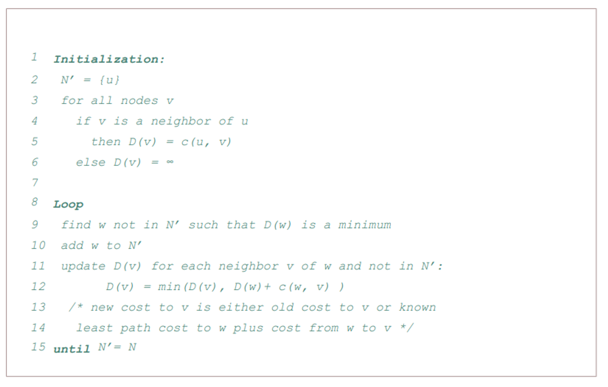

- 링크 상태 알고리즘이 종료된 후에 각 노드에 대해 출발지 노드로부터의 최소 비용 경로상의 직전 노드를 알게된다.
- 각각의 직전 노드는 또 그 직전 노드를 가지며 이러한 방식으로 출발지에서 모든 목적지까지의 전체 경로를 구축할 수 있다.

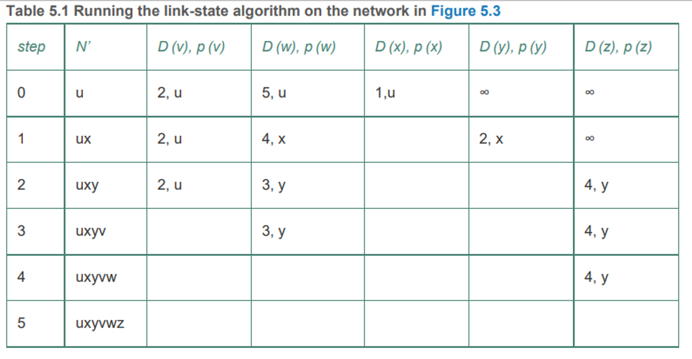

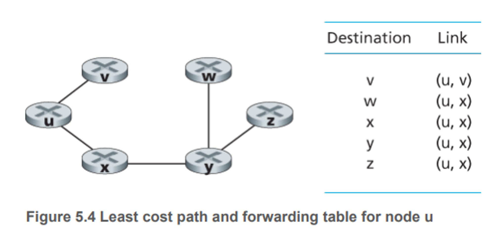

- 그럼 이 알고리즘의 시간 복잡도는 얼마일까?
- 첫 번째 반복에서 최소 비용이 이미 계산된 노드의 집합 N’ 에 포함되지 않은 노드 w를 결정하기 위해 모든 n개의 노드를 검사해야 한다.
- 두 번째 반복에서는 최소 비용을 결정하기 위해 n-1개를 그 다음에는 n-2개를 ….
- 이렇게 반복하면 찾아야하는 노드의 총 수는 n(n+1)/2이다.
- 그러면 최악의 경우 O(N^2)의 시간 복잡도를 가지게 된다.
- 하지만 이것을 줄여서 O(NlogN)을 만드는 방법이 있는데 그것은 바로 우선순위 큐를 사용하는 경우이다.
- 그럼 해당 링크 상태 알고리즘은 문제가 없을까?

<table>
  <tr>
    <td align="center">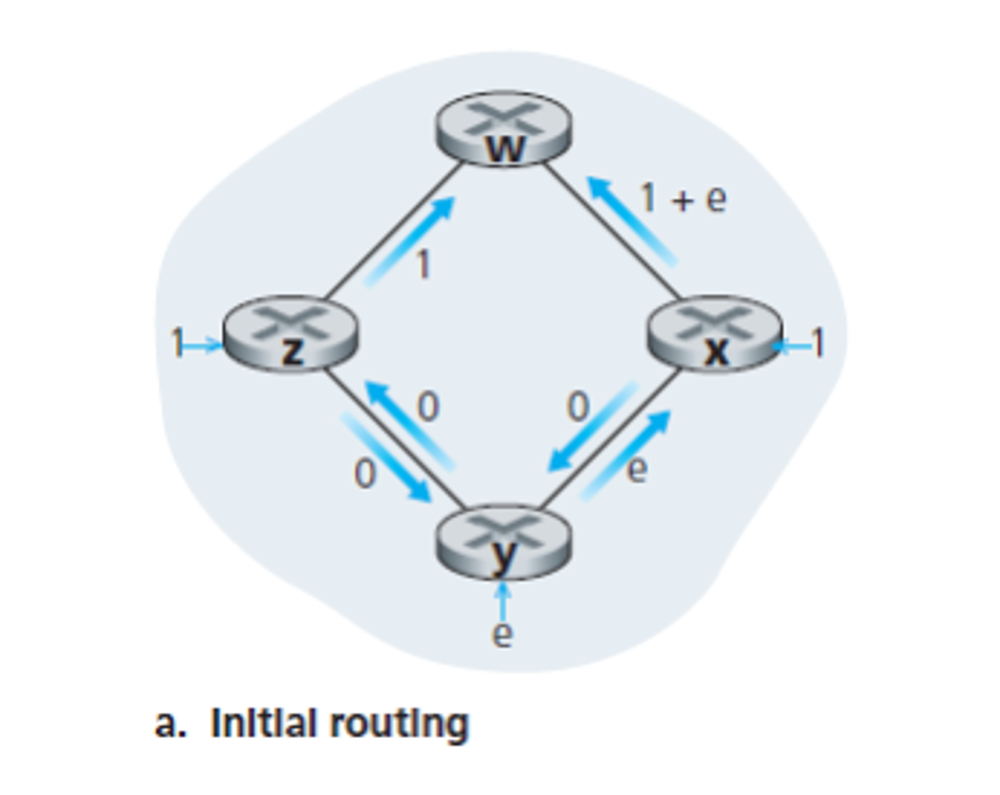</td>
    <td align="center">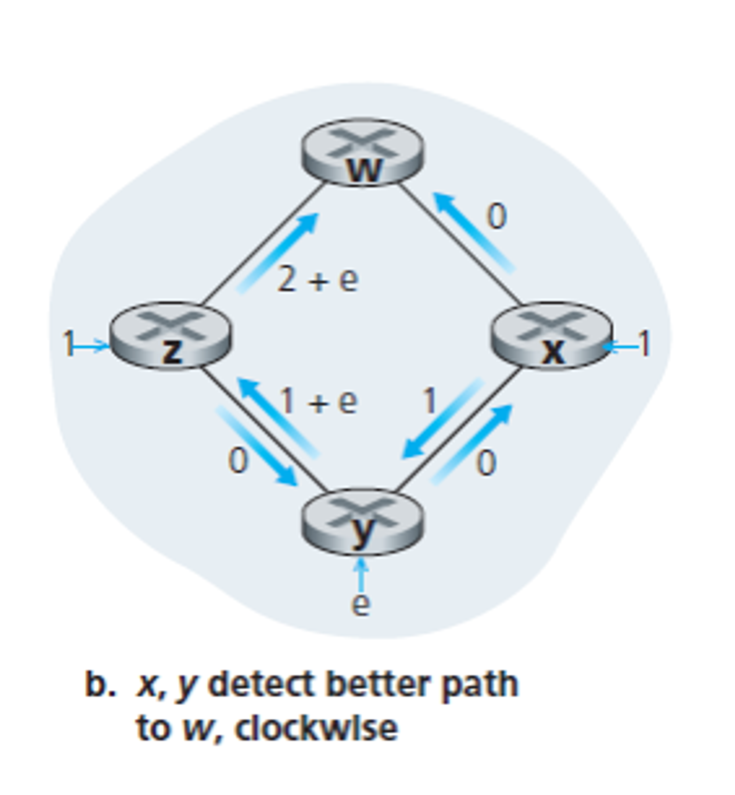</td>
  </tr>
  <tr>
    <td align="center">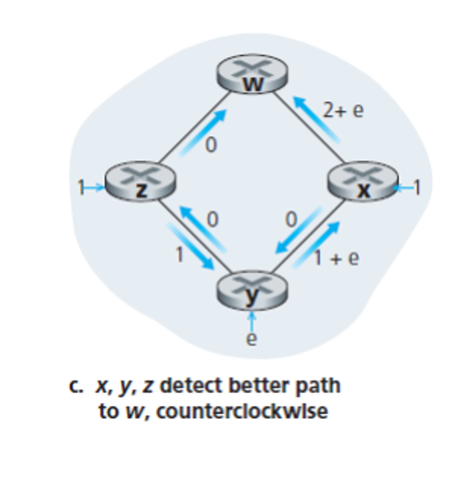</td>
    <td align="center">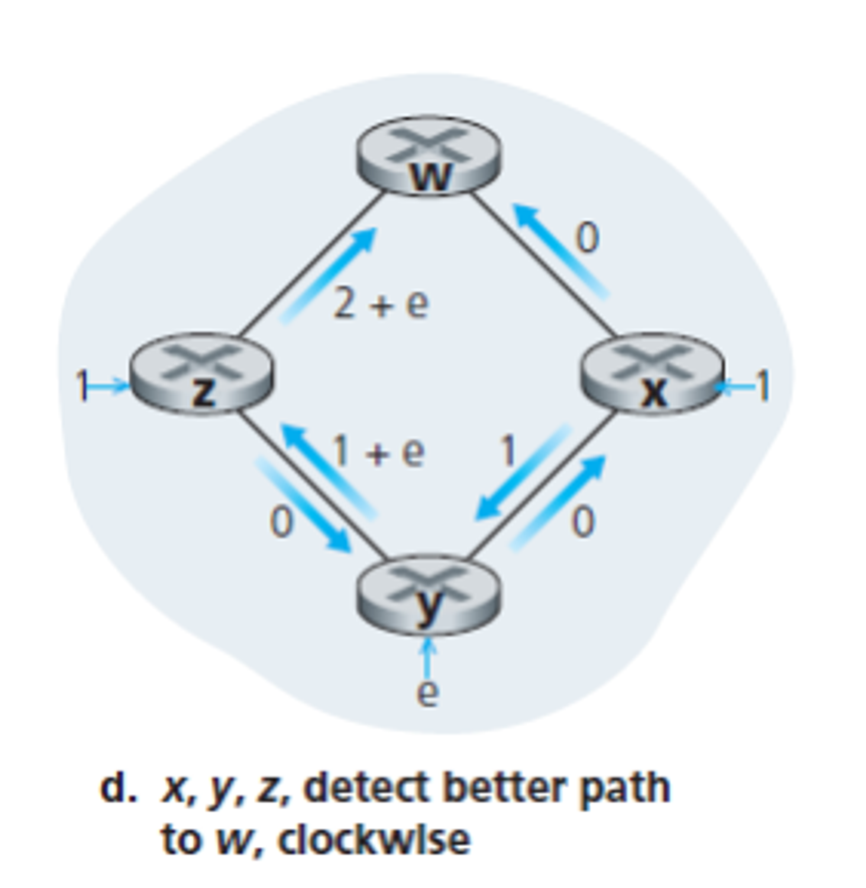</td>
  </tr>
</table>

- 초기 라우팅 세팅된 이후 링크 값이 변경되어 더 나은 경로를 감지하게 되면 어떻게 될까?
- 그 값을 반영해야하며 새로운 최소 비용 경로를 결정하게 된다.
- 이러한 진동 문제를 방지하려면 어떻게 해야 할까?
- 한 가지 해결책은 링크 비용이 해당 링크가 전달하는 트래픽의 양에 의존하지 않도록 하는 것이다.
- 하지만 이러면 라우팅의 목적에 위배가 된다.
- 다른 해결책으로, 모든 라우터가 동시에 링크 상태 알고리즘을 실행하지 못하도록 하면 된다.
- 즉, 스스로 자기 동기화하게 하는 것

## 5.2.2 거리 벡터(DV) 라우팅 알고리즘

- 반복적이고 비동기적이며 분산적
- 각 노드는 하나 이상의 직접 연결된 이웃으로부터 정보를 받고, 계산을 수행하며, 계산된 결과를 다시 이웃들에게 배포한다는 점에서 분산적이다.
- 이웃끼리 더 이상 정보를 교환하지 않을 때까지 프로세스가 지속된다는 점에서 반복적
- 또한 모든 노드가 서로 정확히 맞물려 동작할 필요가 없기에 비동기적
- 노드 x 부터 y 까지 최소 비용 경로의 비용을 d(y) 라고 하자.
- 최소 비용은 벨란-포드 식에 의해 나타내짐

$$
dx(y) = minv(c(x,v) + dv(y))
$$

- x에서 v로 이동한 후, v에서 y까지의 최소 비용 경로를 택한다면, 경로 비용은 c(x,v) + dv(y)
- 반드시 하나의 이웃 v로 가는 것부터 시작해야 하므로, x에서 y까지의 최소 비용은 모든 이웃 노드 v에 대해 계산된 c(x,v) + dv(y) 중 최솟값이 된다.
- 벨만-포드 식의 해답은 각 노드 포워딩 테이블의 엔트리를 제공한다.
- 각 노드가 자신의 거리 벡터를 이웃들에게 보낸다.
- 노드 x가 이웃 w에게서 새로운 거리 벡터를 수신하면, x는 w의 거리 벡터를 저장하고 벨만-포드 식을 사용하여 자신의 거리 벡터를 갱신한다.
- 만약 이 갱신으로 노드 x의 거리 벡터가 변경된다면 이웃에게 보내고 이웃들도 자신의 거리 벡터를 갱신한다.

### 거리 벡터 알고리즘

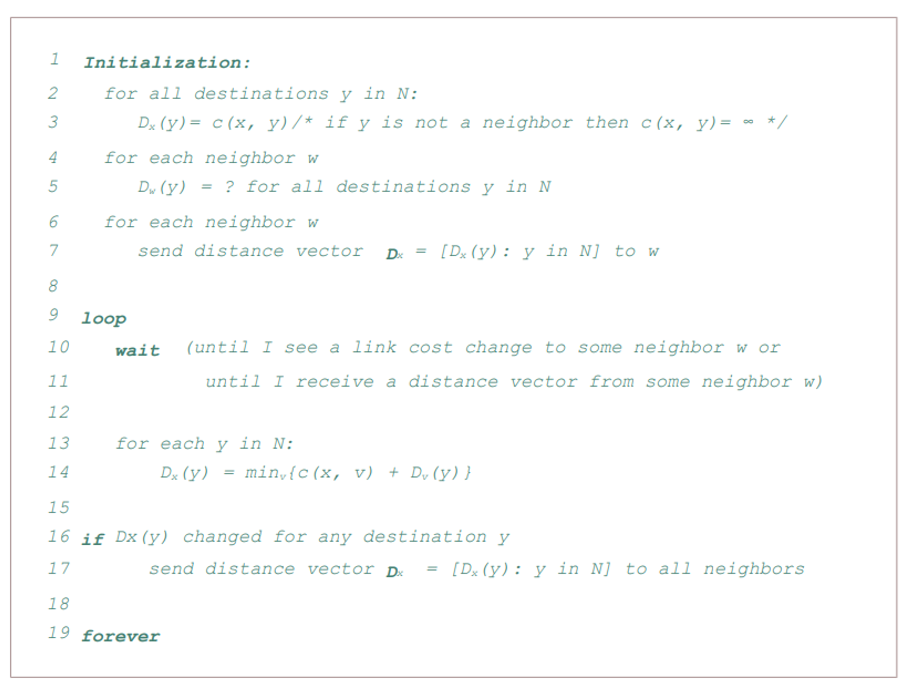

- 어떤 노드 x가 자신에게 직접 연결된 링크 중 하나의 비용이 변경된 사실을 알게 되거나 어떤 이웃으로부터 변경된 거리 벡터를 수신했을 때 자신의 거리 벡터 추정 값을 갱신한다.
- 특정 목적지 y에[ 대한 자신의 포워딩 테이블을 갱신하기 위해 노드 x가 정말 알아야 하는 것은 y까지의 최단 경로 거리가 아니라 y로의 최단 경소상의 다음 홉 라우터인 이웃 노드 v*(y)
- 하나의 노드가 갖는 정보는 단지 자신에게 직접 연결된 이웃으로의 링크 비용과 그 이웃드로부터 수신하는 정보

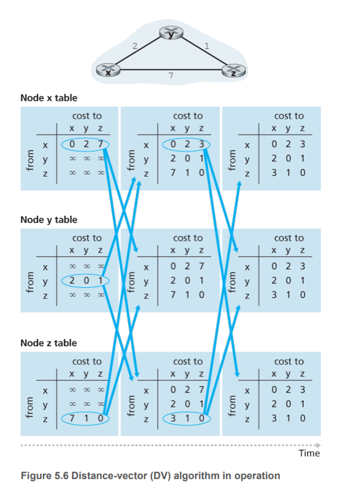

- 알고리즘의 동작은 동기적 방식이다.
- 즉, 모든 노드가 동시에 이웃에게서 거리 벡터를 받고, 새로운 거리 벡터를 계산해서 변화가 있다면 그들의 이웃에게 알린다.
- 하지만 비동기적 방식으로도 올바르게 동작한다.
- 이웃으로부터 갱신된 거리 벡터를 받고, 라우팅 테이블 엔트리를 계산하고, 목적지까지 최소 비용 경로의 비용 변경 값을 알리는 과정은 더 이상의 갱신 메시지가 없을 때까지 계속 된다.
- 갱신 메시지가 더 이상 없으면 라우팅 테이블 계산도 더 이상 없고 알고리즘은 정지 상태가 된다.

### 거리 벡터 알고리즘: 링크 비용 변경과 링크 고장

- 이웃 사이 링크의 비용이 변경된 것을 알게되면 위와 같은 일련의 과정들을 거친다.
- 아래의 예시를 들어보자.

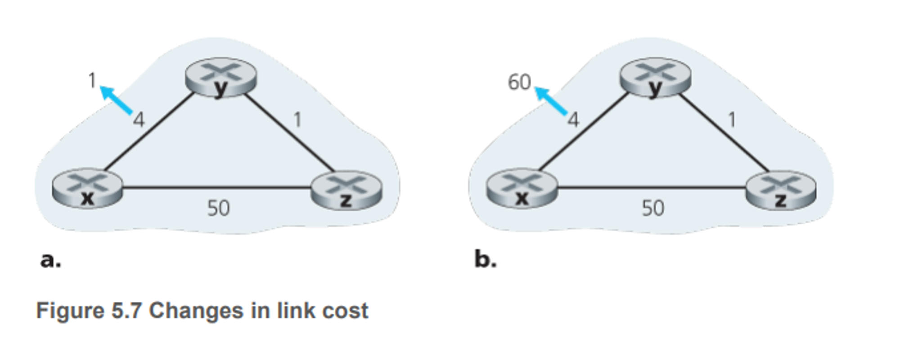

- 링크 비용이 감소하게된다면 즉, 4 → 1로 바뀌게 된다면 2번의 갱신 과정을 반복하게 된다.
    - y가 자신의 거리 벡터를 갱신한 후 이웃에게 알린다.
    - z는 y로부터 갱신 정보를 받고 자신의 테이블을 갱신하고 새로운 거리 벡터를 이웃에게 전달한다.
    - y는 z로부터 갱신 정보를 받고 테이블을 갱신한다. y의 최소 비용은 변화가 없으므로 알고리즘은 정지한다.
- 그럼 4 → 60으로 증가하는 경우를 보자
    - 변화를 감지하고 y에서 최소 비용을 갱신한다. Dy(x) = 6
    - 노드 y가 가진 유일한 정보는 x까지 직접 가는 경로 비용이 60이고 z가 가장 최근에 y에게 x에 도착하려면 5의 비용이 필요하다고 했으므로 저 값이 된다.
    - z는 y로 경로 설정을 하고 y는 z로 경로 설정하는 라우팅 루프가 발생
    - 노드 y는 x까지의 새로운 최소 비용을 z에게 알린다.
    - z는 새로운 거리 벡터를 받고 최소 비용을 갱신한다. Dz(x) = 7을 계산한다.
    - z의 새로운 거리 벡터를 수신하고 Dy(x) = 8을 결정하고 이 거리를 z에게 보내고 이 작업이 반복된다.
- 이러한 문제를 보면 계속 진동하는 것을 볼 수 있으며 이러한 문제를 무한 계수 문제라고 한다.

### 거리 벡터 알고리즘: 포이즌 리버스 추가

- 위에서 발생한 라우팅 루프 문제를 포이즌 리버스라는 방법을 사용해 방지할 수 있다.
- 만약 z가 y를 통해 목적지 x로 가는 경로 설정을 했다면, z는 y에게 x까지의 거리가 무한대라고 알린다. Dz(x) = 무한
- y는 z에서 x로 가는 경로가 없다고 믿으므로, z가 계속해서 y를 통해 x로 가는 경로를 사용하는 동안은 y는 z를 통해 x로 가는 경로를 시도하지 않는다.
- 그럼 포이즌 리버스가 무한 계수 문제를 해결할까?
    - 그렇지 않다.
    - 3개 이상의 노드를 포함한 루프는 포이즌 리버스로는 감지할 수 없다.
    

### 링크 상태 알고리즘과 거리 벡터 라우팅 알고리즘의 비교

- 메시지 복합성
    - 링크 상태 알고리즘에서 각 노드는 네트워크 내 각 링크 비용을 알아야 한다. 이를 위해서 O(|N||E|)개의 메시지가 전송되어야 한다.
    - 링크 비용이 변할 때마다 새로운 링크 비용이 모든 노드에게 전달되어야 한다.
    - 거리 벡터 알고리즘은 매번 반복마다 직접 연결된 이웃끼리 메시지를 교환한다.
    - 알고리즘의 결과가 수렴하는데는 꽤 시간이 소요된다.
    - 링크 비용이 변하고, 이 새로운 링크 비용이 이 링크에 연결된 어떤 노드의 최소 비용 경로에 변화를 준 경우에만 DV 알고리즘은 수정된 링크 비용을 전파한다.
- 수렴 속도
    - 링크 상태 알고리즘은 O(N^2) 이 걸린다. 거리 벡터 알고리즘은 천천히 수렴하고 알고리즘이 수렴하는 동안 라우팅 루프가 발생할 수 있다. 또한 무한 계수 문제가 일어날 수 있다.
- 견고성
    - 링크 상태 알고리즘에서 라우터는 연결된 링크에 대해 잘못된 비용 정보를 브로드캐스트할 수 있다.
    - 또한 노드는 링크 상태 브로드캐스트를 통해 받은 패킷을 변질시키거나 폐기할 수 있다.
    - 하나의 링크 상태 노드는 자신의 포워딩 테이블만 계산하고, 다른 노드들 역시 자신의 테이블을 만들기 위한 유사한 계산을 수행한다.
    - 이 말은 적어도 어느 정도 분산되어 경로 계산이 이루어진다는 의미이다.
    - 따라서 어느 정도의 견고성은 제공한다.
    - 거리 벡터 알고리즘은 잘못된 정보를 일부의 노드만 알릴 수 있다.
    - 각 반복마다 한 노드의 거리 벡터 계산이 이웃에게 전달되고 다음 반복에서 이웃의 이웃에게 간접적으로 전달된다.
    - 이런 측면에서 거리 벡터 알고리즘을 사용하는 네트워크에서 한 노드의 잘못된 계산은 전체로 확산될 수 있다.